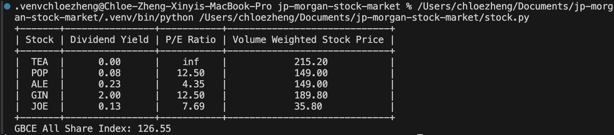

# Project Documentation

This project uses
1. python 3.13
2. pip 24.3.1

### Prerequisites
1. **Python 3.x**: Ensure you have Python 3.x installed on your machine. You can download it from [python.org](https://www.python.org/).
2. **pip**: Python package installer. It usually comes with Python, but you can install it separately if needed.

### Installation Steps
1. **Clone the Repository**:
    ```sh
    git clone https://github.com/chloezxyy/stock-market
    cd jp-morgan
    ```

2. **Create a Virtual Environment** (optional but recommended):
    ```sh
    python3 -m venv venv
    source venv/bin/activate  # On Windows use `venv\Scripts\activate`
    ```

3. **Install pip** (if not already installed):
    ```sh
    python -m ensurepip --upgrade
    ```

4. **Install Required Libraries**:
    ```sh
    pip install -r requirements.txt
    ```

### Running the Project
1. **Navigate to the Project Directory**:
    ```sh
    cd /path/to/jp-morgan
    ```

2. **Run the `stock.py` File**:
    ```sh
    python stock.py
    ```
3. **Run the `test_stock.py` File**:
    ```sh
    python -m unittest stock.test.py
    ```

### How to add your own values?
In the ```main``` method of `stock.py` file, there is an option to add your own trades to each stock to run the calculation and observe the values that will be printed in the terminal. 

Please refer to ```test_gbce_all_share_index``` method in `test_stock.py` on how to record trades.

Here is an example of how the table will look like:


# stock-market
